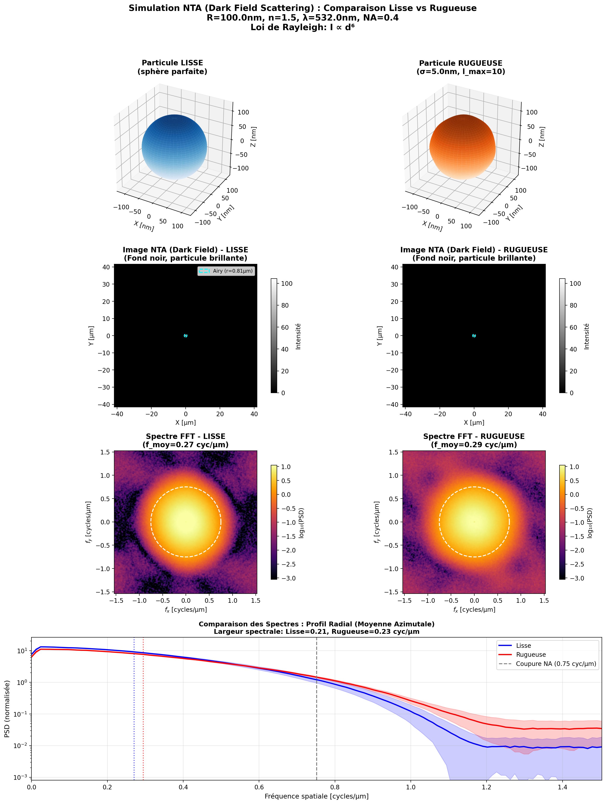

# NTA FDTD Simulation

## Nanoparticle Tracking Analysis - Optical Imaging with MEEP FDTD

This module simulates a single camera frame of a **Videodrop-like NTA system** using FDTD (Finite-Difference Time-Domain) with MEEP. It physically models how surface roughness (granularity/asperities) affects the visual appearance of nanoparticles in optical imaging.

---

## 🎯 Objective

Generate the **2D camera intensity image** of a single nanoparticle illuminated by a laser:
- No Brownian motion (static particle)
- Study how **surface roughness** affects the observed optical image
- Pure optical image formation, not particle tracking or sizing

---

## 📋 Physical Setup

### Simulation Method
- **FDTD** (Maxwell's equations solved on a 3D grid)
- **MEEP** as the computational engine

### Medium
- Water (n = 1.33)
- Dispersion neglected

### Nanoparticle
| Parameter | Range | Notes |
|-----------|-------|-------|
| Geometry | Sphere with roughness | Spherical harmonics perturbation |
| Size | 20-300 nm | Rayleigh to Mie regime |
| Refractive index | 1.45-1.60 | User-defined (polystyrene ~1.59) |
| Roughness RMS | 0-20 nm | Controllable amplitude |
| Roughness l_max | 5-20 | Angular resolution of asperities |

### Illumination
- Coherent plane wave (laser-like)
- Wavelength: 405, 488, 532, or 638 nm
- Linear polarization (user-defined axis)

### Boundaries
- **PML** (Perfectly Matched Layers) for absorption

---

## 🔬 Detection / Imaging Model

1. **Compute scattered electromagnetic fields** via FDTD
2. **Near-to-far-field transformation** using Love's equivalence theorem
3. **Apply finite NA** (Numerical Aperture) filter
4. **Integrate intensity** to form 2D camera image (single frame)

Output: Pixelated intensity map comparable to a Videodrop frame.

---

## 📁 File Structure

```
NTA/
├── nta_fdtd_simulation.py   # Main simulation module (modular, documented)
├── demo_nta_simulation.py   # Demonstration and examples
├── blender.py               # Blender visualization (pre-existing)
├── requirement.txt          # Python dependencies
└── README.md                # This file
```

---

## 🚀 Quick Start

### 1. Install Dependencies

```bash
pip install numpy scipy matplotlib

# For full FDTD (optional, see MEEP installation below):
# conda install -c conda-forge meep
```

### 2. Run Demo (Mock Mode)

```bash
python demo_nta_simulation.py
```

This generates several demonstration figures without requiring MEEP.

### 3. Run Comparison

```bash
python nta_fdtd_simulation.py --mode compare --radius 80 --roughness 5
```

### 4. Run Single Simulation

```bash
python nta_fdtd_simulation.py --mode single --radius 100 --roughness 3 --na 0.3
```

---

## 📊 Usage Examples

### Basic Simulation

```python
from nta_fdtd_simulation import (
    ParticleParameters,
    IlluminationParameters,
    ImagingParameters,
    SimulationParameters,
    NTAFDTDSimulation
)

# Define particle (with 5nm RMS roughness)
particle = ParticleParameters(
    radius_nm=80.0,
    refractive_index=1.50,
    roughness_amplitude_nm=5.0,
    roughness_lmax=10
)

# Define illumination
illumination = IlluminationParameters(
    wavelength_nm=488.0,
    polarization="x",
    propagation_direction="z"
)

# Define imaging system
imaging = ImagingParameters(
    numerical_aperture=0.3,
    magnification=20.0,
    image_pixels=64
)

# Define simulation parameters
simulation = SimulationParameters(
    resolution=50,
    simulation_time_factor=100
)

# Create and run simulation
sim = NTAFDTDSimulation(particle, illumination, imaging, simulation)
sim.run()
sim.compute_far_field()
camera_image = sim.generate_camera_image()
sim.plot_results(save_path="my_simulation.png")
```

### Compare Smooth vs Rough

```python
from nta_fdtd_simulation import compare_smooth_vs_rough

sim_smooth, sim_rough = compare_smooth_vs_rough(
    radius_nm=80.0,
    roughness_nm=5.0,
    roughness_lmax=10,
    save_path="comparison.png"
)
```

---

## 🧮 Physics: Surface Roughness Model

Surface roughness is modeled using **spherical harmonics** perturbation:

$$r(\theta, \phi) = R_0 + \sum_{l=2}^{l_{\max}} \sum_{m=-l}^{l} a_{lm} Y_l^m(\theta, \phi)$$

Where:
- $R_0$ = base radius
- $a_{lm}$ = random coefficients with power spectrum $P(l) \propto e^{-l/l_c}$
- $Y_l^m$ = spherical harmonics
- $l_{\max}$ = maximum angular order (higher = finer features)

### Physical Effects of Roughness

| Effect | Mechanism | Observable |
|--------|-----------|------------|
| **Modified cross-section** | Additional scattering centers | Intensity change |
| **Angular redistribution** | Multipole excitation | Pattern asymmetry |
| **Speckle** | Coherent interference | Intensity fluctuations |
| **Depolarization** | Cross-polarized components | Contrast reduction |
| **PSF distortion** | Asymmetric scattering | Shape changes |

---

## ⚙️ Command Line Arguments

```
usage: nta_fdtd_simulation.py [-h] [--mode {single,compare}] [--radius R]
                               [--roughness σ] [--lmax L] [--n-particle N]
                               [--wavelength λ] [--na NA] [--no-save]

Arguments:
  --mode        single | compare (default: compare)
  --radius      Particle radius in nm (default: 80)
  --roughness   Surface roughness RMS in nm (default: 5)
  --lmax        Max spherical harmonic order (default: 10)
  --n-particle  Particle refractive index (default: 1.50)
  --wavelength  Laser wavelength in nm (default: 488)
  --na          Objective NA (default: 0.3)
  --no-save     Don't save output figures
```

---

## 📐 Scattering Regimes

| Size Parameter x | Regime | Characteristics |
|------------------|--------|-----------------|
| x < 0.3 | **Rayleigh** | σ ∝ r⁶, dipole-like pattern |
| 0.3 < x < 1 | **Transition** | Mixed multipoles |
| x > 1 | **Mie** | Complex lobes, σ ∝ r² |

Where: $x = \frac{2\pi r}{\lambda_{\text{medium}}}$

For λ = 488 nm in water:
- r = 40 nm → x ≈ 0.68 (transition)
- r = 80 nm → x ≈ 1.37 (Mie)
- r = 150 nm → x ≈ 2.57 (Mie)

---

## 🔧 Installing MEEP (Full FDTD)

For complete electromagnetic simulation, install MEEP:

### Conda (Recommended)
```bash
conda create -n meep -c conda-forge meep pymeep
conda activate meep
```

### From Source
See: https://meep.readthedocs.io/en/latest/Installation/

### Mock Mode
Without MEEP, the code runs in **mock mode** using analytical approximations:
- Rayleigh dipole pattern for scattering
- Roughness-modulated speckle
- Gaussian PSF for imaging

---

## 📊 Output Examples

### 1. Particle Geometry Comparison


### 2. Far-Field Scattering Pattern


### 3. Camera Image (Smooth vs Rough)


---

## 🔬 Physical Assumptions (Explicit)

| Assumption | Description | Validity |
|------------|-------------|----------|
| Homogeneous medium | Water n=1.33, no dispersion | Valid for narrowband laser |
| Dielectric particle | Real refractive index | Not for metallic particles |
| Plane wave illumination | Collimated laser beam | Valid if beam waist >> particle |
| Linear polarization | Single polarization state | Typical for NTA lasers |
| Steady-state | No time evolution | No Brownian motion |
| Far-field detection | Large distance approximation | Valid for f >> λ |
| Scalar diffraction | Paraxial approximation for imaging | Valid for low NA |

---

## 📚 References

1. **MEEP**: A. Oskooi et al., "MEEP: A flexible free-software package for electromagnetic simulations by the FDTD method," Computer Physics Communications 181, 687–702 (2010)

2. **Mie Theory**: C.F. Bohren and D.R. Huffman, "Absorption and Scattering of Light by Small Particles" (Wiley, 1983)

3. **NTA**: R. Dragovic et al., "Sizing and phenotyping of cellular vesicles using Nanoparticle Tracking Analysis," Nanomedicine 7, 780–788 (2011)

4. **Roughness scattering**: J.A. Sánchez-Gil and M. Nieto-Vesperinas, "Light scattering from random rough dielectric surfaces," JOSA A 8, 1270–1286 (1991)

---

## 📄 License

MIT License - See LICENSE file for details.

---

## 👥 Contributing

Contributions welcome! Please:
1. Fork the repository
2. Create a feature branch
3. Add tests for new functionality
4. Submit a pull request

---

## 🐛 Troubleshooting

### ImportError: sph_harm
**Solution**: Code auto-detects scipy version. Upgrade scipy if issues persist:
```bash
pip install --upgrade scipy>=1.15
```

### MEEP not found
**Solution**: Run in mock mode (default) or install MEEP via conda.

### Slow simulation
**Solution**: Reduce resolution or particle size:
```python
simulation = SimulationParameters(resolution=30)  # Lower resolution
```

---

*Developed for computational nanophotonics research in NTA systems.*
